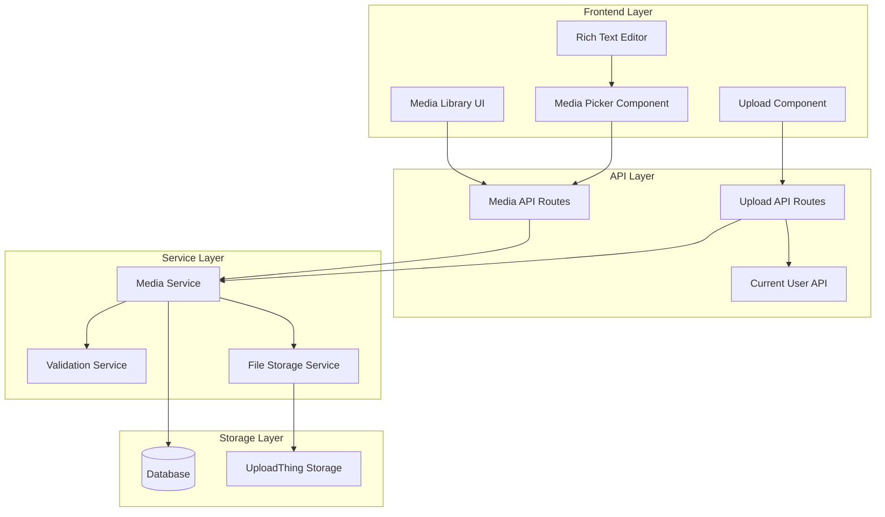

# Media Management System Design

## Overview

The Media Management System provides a comprehensive solution for uploading, storing, organizing, and managing media files within the application. The system addresses current issues with upload validation, file persistence, and media integration while providing a robust foundation for future enhancements.

### Key Design Principles

- **Persistent Storage**: Media files remain available until explicitly deleted by administrators
- **Robust Validation**: Clear file type, size, and format validation with helpful error messages
- **Seamless Integration**: Easy media selection and embedding in content creation workflows
- **User-Friendly Interface**: Intuitive media library with search, filtering, and organization features
- **Error Resilience**: Graceful handling of upload failures with retry mechanisms

## Architecture

### System Components



### Data Flow

1. **Upload Process**: User selects files → Validation → UploadThing upload → Database record creation
2. **Media Library**: Fetch media from database → Display with metadata → Enable management actions
3. **Media Selection**: Browse library → Select media → Insert reference into content
4. **Content Integration**: Media references maintained in articles and other content types

## Components and Interfaces

### 1. Enhanced Media API (`/api/media`)

**Endpoints:**
- `GET /api/media` - List media with filtering and pagination
- `POST /api/media` - Create media record after upload
- `GET /api/media/[id]` - Get specific media details
- `PUT /api/media/[id]` - Update media metadata
- `DELETE /api/media/[id]` - Delete media and file

**Features:**
- Advanced filtering by type, date, size, and search terms
- Pagination for large media libraries
- Batch operations for multiple media items
- Usage tracking to prevent deletion of referenced media

### 2. Upload Validation Service

**File Type Validation:**
- Images: jpg, jpeg, png, gif, webp, svg, bmp, ico
- Videos: mp4, webm, avi, mov, wmv, flv, mkv
- Documents: pdf, doc, docx, txt, rtf
- Audio: mp3, wav, ogg, aac, flac, m4a

**Size Limits:**
- Images: 10MB maximum
- Videos: 50MB maximum
- Documents: 5MB maximum
- Audio: 10MB maximum

**Validation Process:**
- MIME type verification
- File extension validation
- File size checking
- Malicious file detection (basic)

### 3. Enhanced Media Picker Component

**Features:**
- Grid and list view modes
- Real-time search and filtering
- Drag-and-drop upload support
- Batch selection capabilities
- Preview functionality for all media types
- URL-based media addition
- Integration with rich text editor

### 4. Media Library Management Interface

**Core Features:**
- Comprehensive media grid with thumbnails
- Advanced search and filtering options
- Bulk selection and operations
- Media metadata editing
- Usage tracking and reference display
- Storage statistics and analytics

### 5. UploadThing Integration Enhancement

**Current Issues to Address:**
- Invalid media type errors
- Missing authentication context
- Incomplete database integration
- Limited file type support

**Enhanced Configuration:**
```typescript
export const ourFileRouter = {
  mediaUploader: f({
    image: { maxFileSize: "10MB", maxFileCount: 10 },
    video: { maxFileSize: "50MB", maxFileCount: 5 },
    audio: { maxFileSize: "10MB", maxFileCount: 10 },
    pdf: { maxFileSize: "5MB", maxFileCount: 10 }
  })
  .middleware(async ({ req }) => {
    // Proper authentication validation
    const user = await getCurrentUser(req);
    if (!user || user.role !== 'ADMIN') {
      throw new Error('Unauthorized');
    }
    return { userId: user.id };
  })
  .onUploadComplete(async ({ metadata, file }) => {
    // Enhanced database integration
    await createMediaRecord({
      url: file.url,
      type: detectMediaType(file),
      metadata: extractFileMetadata(file),
      createdById: metadata.userId
    });
  })
}
```

## Data Models

### Enhanced MediaAsset Model

```typescript
interface MediaAsset {
  id: string;
  url: string;
  type: MediaType;
  filename: string;
  mimeType: string;
  fileSize: number;
  width?: number;
  height?: number;
  duration?: number; // for video/audio
  blurhash?: string;
  altText?: string;
  seoTitle?: string;
  description?: string;
  tags: string[];
  isPublic: boolean;
  usageCount: number;
  lastUsedAt?: Date;
  createdAt: Date;
  updatedAt: Date;
  createdById: string;
  createdBy: User;
}
```

### Media Usage Tracking

```typescript
interface MediaUsage {
  id: string;
  mediaAssetId: string;
  contentType: 'ARTICLE' | 'TRANSLATION' | 'OTHER';
  contentId: string;
  usageType: 'COVER_IMAGE' | 'INLINE_CONTENT' | 'GALLERY';
  createdAt: Date;
}
```

## Error Handling

### Upload Error Scenarios

1. **File Type Validation Failure**
   - Clear error message indicating supported formats
   - Suggestion to convert file to supported format

2. **File Size Exceeded**
   - Specific size limit information
   - Compression suggestions for images/videos

3. **Network Upload Failure**
   - Retry mechanism with exponential backoff
   - Resume capability for large files

4. **Authentication Errors**
   - Clear login requirement message
   - Redirect to authentication flow

5. **Storage Service Errors**
   - Fallback error handling
   - Admin notification for service issues

### Database Error Handling

- Graceful degradation when database is unavailable
- Retry mechanisms for transient failures
- Data consistency checks and recovery

## Testing Strategy

### Unit Tests

1. **Validation Service Tests**
   - File type validation accuracy
   - Size limit enforcement
   - MIME type verification

2. **Media API Tests**
   - CRUD operations functionality
   - Error handling scenarios
   - Authentication and authorization

3. **Component Tests**
   - Media picker functionality
   - Upload component behavior
   - Library interface interactions

### Integration Tests

1. **Upload Flow Tests**
   - End-to-end upload process
   - Database record creation
   - File storage verification

2. **Media Management Tests**
   - Library browsing and filtering
   - Media selection and insertion
   - Bulk operations functionality

3. **Content Integration Tests**
   - Article cover image handling
   - Rich text editor media embedding
   - Reference tracking accuracy

### Performance Tests

1. **Large File Upload Tests**
   - Upload progress tracking
   - Memory usage optimization
   - Timeout handling

2. **Media Library Performance**
   - Large dataset handling
   - Search and filter performance
   - Pagination efficiency

## Security Considerations

### Upload Security

- File type validation to prevent malicious uploads
- Size limits to prevent storage abuse
- Virus scanning integration (future enhancement)
- User authentication and authorization

### Access Control

- Admin-only upload and management capabilities
- Public/private media designation
- URL-based access control for sensitive media

### Data Protection

- Secure file storage with UploadThing
- Database encryption for sensitive metadata
- Audit logging for media operations

## Performance Optimization

### Frontend Optimizations

- Lazy loading for media thumbnails
- Virtual scrolling for large media libraries
- Image optimization and compression
- Progressive loading for media previews

### Backend Optimizations

- Database indexing for search queries
- Caching for frequently accessed media
- CDN integration for media delivery
- Background processing for large uploads

### Storage Optimizations

- Automatic image format optimization
- Thumbnail generation for videos
- Duplicate file detection and deduplication
- Storage usage monitoring and cleanup

## Future Enhancements

### Advanced Features

1. **Media Organization**
   - Folder/album structure
   - Tag-based organization
   - Favorites and collections

2. **Advanced Processing**
   - Automatic image optimization
   - Video thumbnail generation
   - Audio waveform visualization

3. **Collaboration Features**
   - Media sharing between users
   - Comment and annotation system
   - Version control for media updates

4. **Analytics and Insights**
   - Usage analytics and reporting
   - Storage optimization recommendations
   - Popular media identification

### Integration Enhancements

1. **External Storage Support**
   - AWS S3 integration
   - Google Cloud Storage support
   - Cloudinary integration

2. **AI-Powered Features**
   - Automatic alt text generation
   - Content-based image tagging
   - Duplicate detection and removal

3. **Workflow Integration**
   - Approval workflows for media
   - Automated content moderation
   - Scheduled media publishing